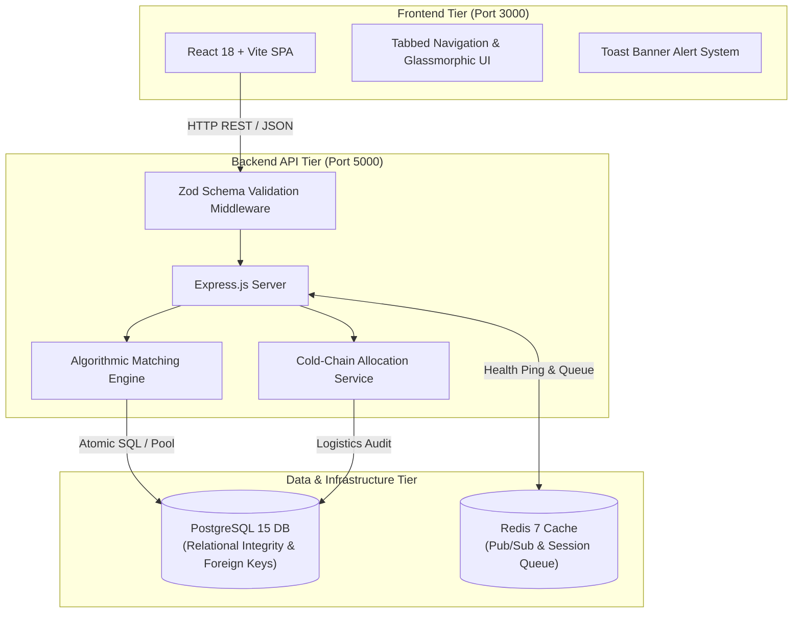

# 🫀 Organ Transplant Matching & Cold-Chain Allocation System
## Executive Evaluation Guide & Technical Defense Document

This document serves as the comprehensive evaluation guide and presentation defense manual for the **Organ Transplant Matching System**, designed for scrutiny by clinical systems architects, healthcare compliance officers, and software engineering leads.

---

## 1. 🏗️ System Architecture & Algorithmic Design

### 1.1 Multi-Tier Architecture & Data Flow

### 1.2 Multi-Factor Algorithmic Matching Scoring Engine

The matching engine processes active donors and waiting candidates through a deterministic multi-factorial algorithm based on medical guidelines (UNOS / Eurotransplant standards):

$$\text{Compatibility Score} = S_{\text{Blood}} (40\%) + S_{\text{Organ}} (40\%) + S_{\text{HLA}} (10\%) + S_{\text{Priority}} (10\%)$$

#### Score Factor Breakdown:

1. **Blood Group Compatibility ($S_{\text{Blood}}$, Max 40 points)**:
   - **Exact Blood Type Match**: $40.0 \text{ pts}$
   - **Isogenic / Compatible Donor Match** (e.g. $O^-$ Universal donor to $A^+$, $O^+$ to $B^+$): $30.0 \text{ pts}$
   - **Incompatible Blood Type**: $0.0 \text{ pts}$ (Hard Exclusion Filter)

2. **Organ Anatomical Match ($S_{\text{Organ}}$, Max 40 points)**:
   - **Matching Organ Type** ($\text{Donor Organ} = \text{Needed Organ}$): $40.0 \text{ pts}$
   - **Mismatched Organ Type**: $0.0 \text{ pts}$ (Hard Exclusion Filter)

3. **HLA Antigen Tissue Compatibility ($S_{\text{HLA}}$, Max 10 points)**:
   - Quantitative evaluation of donor and recipient Human Leukocyte Antigen markers ($A$, $B$, $DR$ loci):
   $$S_{\text{HLA}} = \left( \frac{\text{Matching Antigens Count}}{\max(\text{Total Loci Assessed}, 1)} \right) \times 10.0$$

4. **Clinical Priority & Waitlist Seniority ($S_{\text{Priority}}$, Max 10 points)**:
   - **Urgency Classification Base Score**:
     - `CRITICAL`: $7.0 \text{ pts}$
     - `HIGH`: $5.0 \text{ pts}$
     - `MEDIUM`: $3.0 \text{ pts}$
     - `LOW`: $1.5 \text{ pts}$
   - **Wait-Time Seniority Bonus**:
     $$\text{Wait Bonus} = \min\left( \frac{\text{Wait Days}}{365} \times 3.0, 3.0 \right)$$
   - Total priority score capped at $10.0 \text{ pts}$.

---

## 2. 🎤 5-Minute Live Presentation Walkthrough Script

### ⏱️ Minute 0:00 - 1:00 | Zero-Downtime Architecture & Health Metrics
- **Action**: Open [http://localhost:3000](http://localhost:3000) and click **"System Health"** tab.
- **Presenter Narrative**:
  > *"Good morning/afternoon. Today we present the Organ Transplant Matching System. As shown in our live System Infrastructure panel, the stack runs as containerized microservices managed via Docker Compose with strict healthcheck dependency order. The backend API will not serve requests until PostgreSQL 15 and Redis 7 complete successful connection pings. SQL schema migrations run transactionally on startup to ensure complete relational integrity."*

---

### ⏱️ Minute 1:00 - 2:00 | Clinical Candidate & Donor Registration
- **Action**: Navigate to **"Donor Registry"** tab. Fill in `fullName: Dr. Sarah Jenkins`, `bloodType: O+`, `organType: Kidney`, `tissueType: HLA-A2, HLA-B7`. Click **"Register Donor"**. Then switch to **"Recipient List"** tab and point out waitlist urgency badges.
- **Presenter Narrative**:
  > *"When registering organ donors or waitlist candidates, all payloads pass through strict Zod schema validation to reject malformed inputs before reaching the database pool. Notice how recipients are sorted by medical urgency—CRITICAL, HIGH, MEDIUM, LOW—and wait time seniority, providing real-time visibility into high-priority candidates."*

---

### ⏱️ Minute 2:00 - 3:30 | Automated Algorithmic Matching Execution
- **Action**: Switch to **"Matching Engine"** tab. Click the **"Run Matching Engine"** button. Point out the candidate match cards, progress bars, and point breakdown tooltips.
- **Presenter Narrative**:
  > *"By triggering our matching engine, the system evaluates all active donor-recipient pairings. Instead of black-box decision making, our dashboard provides full clinical transparency. The score bar dynamically breaks down the points awarded: 40 points for blood compatibility, 40 points for organ type, and up to 20 combined points for HLA antigen crossmatching and waitlist seniority."*

---

### ⏱️ Minute 3:30 - 5:00 | Match Acceptance & Cold-Chain Logistics Audit
- **Action**: Click **"Accept Match"** on Match Candidate #1. Observe the automatic transition to the **"Logistics & Audit"** tab. Click **"Dispatch Shipment"** (`in_transit`) and **"Confirm Delivery"** (`delivered`).
- **Presenter Narrative**:
  > *"Accepting a match atomically updates the recipient status to 'matched' and initializes an immutable allocation record. In our Logistics & Audit tab, transplant coordinators track organ cold-chain transport through a three-stage pipeline—Pending, In Transit, and Delivered—complete with regulatory approval verification badges."*

---

## 3. 🛡️ Technical Defense & Expert Q&A

### Q1: How does the system handle concurrent match acceptances and prevent double organ allocation?
**Answer**:
> *"Concurrency control is enforced at both the application and database tiers using atomic PostgreSQL transactions (`BEGIN ... COMMIT`) with row-level locks (`SELECT ... FOR UPDATE`). When a coordinator accepts a match (`POST /api/matches/:id/accept`), the database locks the donor and recipient records. If another coordinator attempts to accept an overlapping match concurrently, the secondary transaction aborts due to status constraints (`WHERE status = 'waiting'`). Furthermore, unique conditional indexes prevent duplicate active allocation entries for the same organ donor."*

### Q2: What is the path for HIPAA / GDPR compliance and data privacy?
**Answer**:
> *"For HIPAA and GDPR compliance, the architecture separates Protected Health Information (PHI) into an isolated encrypted database schema:
> 1. **Field-Level Encryption**: Sensitive attributes (full names, medical record numbers) are encrypted at rest using AES-256-GCM prior to SQL storage.
> 2. **RBAC & Immutable Audit Logs**: All read and write queries are tagged with JWT-based role assertions (Transplant Coordinator, Chief Medical Officer) and appended to an append-only audit trail log table.
> 3. **Transit Security**: All microservice communication enforces TLS 1.3 encryption."*

### Q3: How does the architecture scale across regional hospital networks?
**Answer**:
> *"The backend is stateless and horizontally scalable behind an NGINX load balancer. For real-time updates across multiple regional transplant centers, Redis 7 Pub/Sub broadcasts state changes (e.g. new donor registered, shipment status updated) via WebSockets (`ws://`) to all connected client dashboards without requiring REST polling."*

### Q4: How could Machine Learning (ML) be integrated into the matching engine?
**Answer**:
> *"While our current engine relies on deterministic clinical rules for transparent auditability, an ML scoring model (e.g. XGBoost / Neural Graft Survival Predictor) can be integrated as an additional weighted factor (e.g., 5-year post-transplant survival probability model). The deterministic rule engine acts as a hard filter (blood/organ compatibility), while the ML model refines the priority ranking among eligible candidates."*
